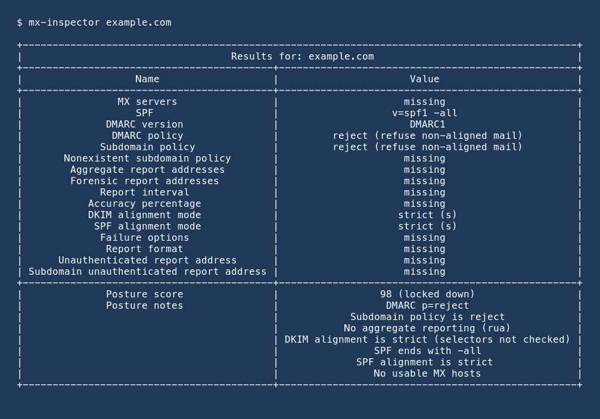

# Examples

## Table (default)

```bash
mx-inspector example.com
```

Live table from `mx-inspector example.com` (piped, so uncoloured). MX
servers are first, then SPF, then DMARC tags. Unpublished tags stay as
`missing`. The posture score is the footer:



## Several domains

```bash
mx-inspector example.com example.org
```

Each domain prints its own table. If one lookup fails, the others still
print and the process exits non-zero.

## Plain table (no colour)

```bash
mx-inspector example.com --no-color
```

`--no-color` or `NO_COLOR` prints the same table without ANSI colour.
The screenshot above is a piped capture, so it already looks like this.

## JSON

```bash
mx-inspector example.com --format json
```

JSON is a list of result objects. Every known policy tag is present;
unpublished tags are `null`. Each object also has `mx`, `spf`, and
`score`:

```json
[
  {
    "domain": "example.com",
    "error": null,
    "mx_error": null,
    "policy": {
      "v": "DMARC1",
      "p": "reject",
      "sp": null,
      "rua": "dmarc@example.com",
      "ruf": null
    },
    "mx": [
      {"priority": 10, "exchange": "mail.example.com"}
    ],
    "spf": ["v=spf1 -all"],
    "spf_error": null,
    "score": {
      "value": 86,
      "grade": "locked down",
      "reasons": [
        "DMARC p=reject",
        "SPF ends with -all"
      ]
    }
  }
]
```

## Probe

Authorised targets only. Default port is 25; use `--port 587` for
submission and `--timeout` when a host is slow:

```bash
mx-inspector example.com --probe
mx-inspector example.com --probe --port 587 --timeout 10 --format json
```

Table output adds mail software, banner, and capabilities after the
DMARC rows and before the posture footer:

```text
| Mail software (mail.example.com)         | Postfix                                    |
| SMTP banner (mail.example.com)           | 220 mail.example.com ESMTP Postfix         |
| SMTP capabilities (mail.example.com)     | PIPELINING                                 |
|                                          | STARTTLS                                   |
```

JSON adds a `probe` list (other fields stay the same):

```json
[
  {
    "domain": "example.com",
    "error": null,
    "mx_error": null,
    "policy": {"p": "reject"},
    "mx": [{"priority": 10, "exchange": "mail.example.com"}],
    "spf": ["v=spf1 -all"],
    "spf_error": null,
    "score": {
      "value": 86,
      "grade": "locked down",
      "reasons": ["DMARC p=reject", "SPF ends with -all"]
    },
    "probe": [
      {
        "host": "mail.example.com",
        "port": 587,
        "banner": "220 mail.example.com ESMTP Postfix",
        "software": "Postfix",
        "capabilities": ["PIPELINING", "STARTTLS"],
        "error": null
      }
    ]
  }
]
```

## Library

```python
from lupaxa.mx_inspector import (
    lookup_dmarc,
    lookup_mx,
    lookup_spf,
    parse_dmarc_record,
    score_posture,
)

policy = lookup_dmarc("example.com")
hosts = lookup_mx("example.com")
spf = lookup_spf("example.com")
score = score_posture(policy, mx_hosts=hosts, spf_records=spf)
print(policy["p"], score.value, score.grade)

for host in hosts:
    print(host.priority, host.exchange)

tags = parse_dmarc_record(
    "v=DMARC1; p=none; rua=mailto:dmarc@example.com"
)
print(tags["rua"])
```

Probe helpers (authorised targets only):

```python
from lupaxa.mx_inspector import lookup_mx, probe_mx_hosts, probe_smtp

hosts = lookup_mx("example.com")
results = probe_mx_hosts(hosts, port=587, timeout=10)
print(results[0].software, results[0].capabilities)

one = probe_smtp("mail.example.com", port=25, timeout=5)
print(one.banner, one.error)
```
